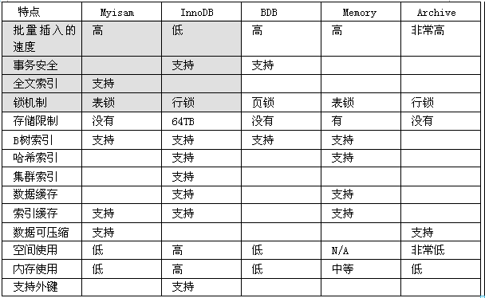

# MySQL如何优化

表的设计合理化 (符合 3NF)

添加适当索引 (index) [ 四种 : 普通索引 、主键索引、唯一索引unique 、全文索引]

SQL语句优化

分表技术 (水平分割 、垂直)

读写 [写: update/delete/add]分离

存储过程 [模块化编程，可以提高速度 ]

对mysql配置优化[配置最大并发数 my.ini, 调整缓存大小]

mysql服务器硬件升级

定时的去清除不需要数据 ,定时进行碎片整理（MYISAM）

# 数据库范式

## 什么是数据库范式

为了建立冗余较小、结构合理的数据库，设计时必须遵循一定的规则。在关系型数据库中这种规则就称为范式。范式是符合某一设计要求的总结。要想设计一个结构合理的关系型数据库，必须满足一定范式。

## 数据库三大范式

第一范式：**1NF是对属性的原子约束，要求(列)具有原子性，不可再分解。**(只要是关系型数据库都满足 1NF)

第二范式：**2NF是对记录的唯一性约束**，表中的记录是唯一, 就满足2NF, 通常我们设计一个主键来实现，不能包含业务逻辑。

第三范式：**3NF是对字段冗余性的约束**，它要求字段没有冗余。 没有冗余的数据库设计可以做到。 但是，没有冗余的数据库未必是最好的数据库，有时为了提高运行效率，就必须降低范式标准，适当保留冗余数据。具体做法是：在概念数据模型设计时遵守第三范式，降低标准的工作放到物理数据模型设计时考虑。降低范式就是增加字段，允许冗余。

# 慢查询

## 什么是慢查询

MySQL默认10秒内没有响应SQL结果 ,则为慢查询。
可以去修改MySQL慢查询默认时间

开启慢查询日志，可以让MySQL记录下查询超过指定时间的语句，通过定位分析性能的瓶颈，才能更好的优化数据库系统的性能。

## 设置慢查询

### 查看慢查询相关参数

slow_query_log 慢查询开启状态

slow_query_log_file 慢查询日志存放的位置（这个目录需要MySQL的运行帐号的可写权限，一般设置为MySQL的数据存放目录）

long_query_time 查询超过多少秒才记录

    >show variables like 'slow_query%';
    +---------------------------+----------------------------------+
    | Variable_name             | Value                            |
    +---------------------------+----------------------------------+
    | slow_query_log            | OFF                              |
    | slow_query_log_file       | /mysql/data/localhost-slow.log   |
    +---------------------------+----------------------------------+

    >show variables like 'long_query_time';
    +-----------------+-----------+
    | Variable_name   | Value     |
    +-----------------+-----------+
    | long_query_time | 10.000000 |
    +-----------------+-----------+

### 设置方法

方法一：全局变量设置

    1、将 slow_query_log 全局变量设置为“ON”状态
    set global slow_query_log='ON';

    2、设置慢查询日志存放的位置
    set global slow_query_log_file='/usr/local/mysql/data/slow.log';

    3、查询超过1秒就记录
    set global long_query_time=1;

方法二：配置文件设置(配置文件/etc/my.cnf)

    修改配置文件my.cnf，在[mysqld]下的下方加入
    [mysqld]
    slow_query_log = ON
    slow_query_log_file = /usr/local/mysql/data/slow.log
    long_query_time = 1

重启MySQL服务
service mysqld restart

# 索引

## 什么是索引 

索引用来快速地寻找那些具有特定值的记录，所MySQL 索引都以 B-树的形式保存。
如果没有索引，执行查询时MySQL必须从第一个记录开始扫描整表的所有记录，直至找到符合要求的记录。表里面的记录数量越多，这个操作的代价就越高。如果作为搜索条件的列上已经创建了索引，MySQL无需扫描任何记录即可迅速得到目标所在的位置。如果表有 1000 个记录，通过索引查找记录至少要比顺序扫描记录快100倍。

## 索引的分类

### 主键索引

**主键是一种唯一性索引，但它必须指定为“PRIMARY KEY”。**如果你曾经过 AUTO_INCREMENT 类型的列，你可能已经熟悉主键之概念了。一般在创建表的时候指定，例如 “CREATE TABLE tablename ( [...], PR IMARY KEY (列的列表) ); ” 。但是，我们也可以通过修改表的方式加入主键例如 “ALTER TABLE tablename ADD PRIMARY KEY (列的列表 ); ” 。**每个表只能有一个主键。**

### 全文索引

错误用法 :

select * from articles where body like '%mysql%'; 错误用法，like后面的‘%xxxx’，索引不会生效，这样‘xxxx%’ 索引生效。

正确用法 :
select * from articles where match(title,body) against ('database')

select match(title,body) against ('database') from articles;（输出的是每行和database的匹配度）

说明 :

1.在mysql中fulltext索引只针对myisam引擎生效

2.mysql自己提供的fulltext针对英文生效 ->sphinx (coreseek) 技术处理中文

3.使用方法是 match(字段名 ..) against(‘关键字’)

4.全文索引的停止词，因为在一个文本中，创建索引是一个无穷大的数，因此对一些常用词 和字符，就不会创建，这些词称为停止词。比如（a，b，mysql，the）

### 普通索引

普通索引（由关键字KEY或INDEX定义的索引）的唯一任务是加快对数据的访问速度，**索引列的值可以重复**。因此，应该只为那些最经常出现在查询条件（WHERE column=）或排序条件（ORDERBY column）中的数据列，创建索引。只要有可能，就应该选择一个数据最整齐、最紧凑的数据列（如一个整数类型的数据列来创建索引。

### 唯一索引

这种索引和前面的 “普通索引 ”基本相同，但有一个区别：**索引列的所值都只能出现一次，即必须唯一。**性索引可以用下几种方式创建：

创建索引，例如 CREATE UNIQUE INDEX <索引的名字> ON tablename (列的列表)；

修改表，例如ALTER TABLE tablename ADD UNIQUE [索引的名字] (列的列表 )；

创建表的时候指定索引，例如 CREATE TABLE tablename ( [...], UNIQUE [索引的名字 ] (列的列表) ；

## 索引的特点

数据库索引，是数据库管理系统中一个排序的结构以协助快速查询、更新数据库表中数据。 索引的实现通常使用B 树及其变种B+树。

在数据之外，数据库系统还维护着满足特定查找算法的数据结构，这些数据结构以某种方式引用（指向）数据，这样就可以在这些数据结构上实现高级查找算法。这种数据结构，就是索引。
为表设置索引要付出的代价：一是增加了数据库存储空间，二在插入和修改时花费较多的时间（因为索引也要随之变动）

上图展示了一种可能的索引方式。
左边是数据表，一共有两列七条记录，最左边的是数据记录的物理地址（注意逻辑上相邻的记录在磁盘上也并不是一定物理相邻的）。为了加快Col2 的查找，可以维护一个右边所示的二叉查找树，每个节点分别包含索引键值和一个指向对应数据记录物理地址的指针，这样就可以运用二叉树查找在O(log2n)的复杂度内获取到相应数据。

### 创建索引好处

创建索引可以大大提高系统的性能。

第一，通过创建唯一性索引，可以保证数据库表中每一行数据的唯一性。

第二，可以大大加快数据的检索速度，这也是创建索引的最主要的原因。

第三，可以加速表和表之间的连接，特别是在实现数据的参考完整性方面特别有意义。

第四，在使用分组和排序子句进行数据检索时，同样可以显著减少查询中分组和排序的时间。

第五，通过使用索引，可以在查询的过程中，使用优化隐藏器，提高系统的性能。

也许会有人要问：增加索引有如此多的优点，为什么不对表中的每一个列创建一个索引呢？因为，增加索引也有许多不利的方面。

### 创建索引的坏处

第一，创建索引和维护索引要耗费时间，这种时间随着数据量的增加而增加。

第二，索引需要占物理空间，除了数据表占数据空间之外，每一个索引还要占一定的物理空间，如果要建立聚簇索引，那么需要的空间就会更大。

第三，当对表中的数据进行增加、删除和修改的时候，索引也要动态的维护，这样就降低了数据的维护速度。

索引是建立在数据库表中的某些列的上面。在创建索引的时候，应该考虑在哪些列上可以创建索引，在哪些列上不能创建索引。

### 一般来说，应该创建索引的列

在经常需要搜索的列上，可以加快搜索的速度；

在作为主键的列上，强制该列的唯一性和组织表中数据的排列结构；

在经常用在连接的列上，这些列主要是一些外键，可以加快连接的速度；

在经常需要根据范围进行搜索的列上创建索引，因为索引已经排序，其指定的范围是连续的；在经常需要排序的列上创建索引，因为索引已经排序，这样查询可以利用索引的排序，加快排序查询时间；

在经常使用在WHERE子句中的列上面创建索引，加快条件的判断速度。

同样，对于有些列不应该创建索引。

### 一般来说，不应该创建索引的列

第一，对于那些在查询中很少使用或者参考的列不应该创建索引。这是因为，既然这些列很少使用到，因此有索引或者无索引，并不能提高查询速度。相反，由于增加了索引，反而降低了系统的维护速度和增大了空间需求。

第二，对于那些只有很少数据值的列也不应该增加索引。这是因为，由于这些列的取值很少，例如人事表的性别列，在查询的结果中，结果集的数据行占了表中数据行的很大比例，即需要在表中搜索的数据行的比例很大。增加索引，并不能明显加快检索速度。

第三，对于那些定义为text, image 和bit 数据类型的列不应该增加索引。这是因为，这些列的数据量要么相当大，要么取值很少。

第四，当修改性能远远大于检索性能时，不应该创建索引。这是因为，修改性能和检索性能是互相矛盾的。当增加索引时，会提高检索性能，但是会降低修改性能。当减少索引时，会提高修改性能，降低检索性能。因此，当修改性能远远大于检索性能时，不应该创建索引。

根据数据库的功能，可以在数据库设计器中创建三种索引：唯一索引、主键索引和聚集索引。

***
唯一索引是不允许其中任何两行具有相同索引值的索引。

当现有数据中存在重复的键值时，大多数数据库不允许将新创建的唯一索引与表一起保存。数据库还可能防止添加将在表中创建重复键值的新数据。例如，如果在employee 表中职员的姓(lname)上创建了唯一索引，则任何两个员工都不能同姓。

主键索引数据库表经常有一列或列组合，其值唯一标识表中的每一行。该列称为表的主键。在数据库关系图中为表定义主键将自动创建主键索引，主键索引是唯一索引的特定类型。该索引要求主键中的每个值都唯一。当在查询中使用主键索引时，它还允许对数据的快速访问。

聚集索引在聚集索引中，表中行的物理顺序与键值的逻辑（索引）顺序相同。一个表只能包含一个聚集索引。

如果某索引不是聚集索引，则表中行的物理顺序与键值的逻辑顺序不匹配。与非聚集索引相比，聚集索引通常提供更快的数据访问速度。

### 局部性原理与磁盘预读

由于存储介质的特性，磁盘本身存取就比主存慢很多，再加上机械运动耗费，磁盘的存取速度往往是主存的几百分之一，因此为了提高效率，要尽量减少磁盘I/O。为了达到这个目的，磁盘往往不是严格按需读取，而是每次都会预读，即使只需要一个字节，磁盘也会从这个位置开始，顺序向后读取一定长度的数据放入内存。这样做的理论依据是计算机科学中著名的局部性原理：当一个数据被用到时，其附近的数据也通常会马上被使用。程序运行期间所需要的数据通常比较集中。

由于磁盘顺序读取的效率很高（不需要寻道时间，只需很少的旋转时间），因此对于具有局部性的程序来说，预读可以提高I/O 效率。

预读的长度一般为页（page）的整倍数。页是计算机管理存储器的逻辑块，硬件及操作系统往往将主存和磁盘存储区分割为连续的大小相等的块，每个存储块称为一页（在许多操作系统中，页得大小通常为4k），主存和磁盘以页为单位交换数据。当程序要读取的数据不在主存中时，会触发一个缺页异常，此时系统会向磁盘发出读盘信号，磁盘会找到数据的起始位置并向后连续读取一页或几页载入内存中，然后异常返回，程序继续运行。

### B-/+Tree 索引的性能分析

上文说过一般使用磁盘I/O次数评价索引结构的优劣。先从B-Tree 分析，根据B-Tree 的定义，可知检索一次最多需要访问h 个节点。数据库系统的设计者巧妙利用了磁盘预读原理，将一个节点的大小设为等于一个页，这样每个节点只需要一次I/O 就可以完全载入。为了达到这个目的，在实际实现B-Tree 还需要使用如下技巧：

每次新建节点时，直接申请一个页的空间，这样就保证一个节点物理上也存储在一个页里，加之计算机存储分配都是按页对齐的，就实现了一个node 只需一次I/O。

B-Tree 中一次检索最多需要h-1 次I/O（根节点常驻内存），渐进复杂度为O(h)=O(logdN)。一般实际应用中，出度d 是非常大的数字，通常超过100，因此h 非常小（通常不超过3）。
而红黑树这种结构，h 明显要深的多。由于逻辑上很近的节点（父子）物理上可能很远，无法利用局部性，所以红黑树的I/O 渐进复杂度也为O(h)，效率明显比B-Tree 差很多。
综上所述，用B-Tree 作为索引结构效率是非常高的。
应该花时间学习B-树和B+ 树数据结构
***

1）B 树

B 树中每个节点包含了键值和键值对于的数据对象存放地址指针，所以成功搜索一个对象可以不用到达树的叶节点。

成功搜索包括节点内搜索和沿某一路径的搜索，成功搜索时间取决于关键码所在的层次以及节点内关键码的数量。

在B 树中查找给定关键字的方法是：首先把根结点取来，在根结点所包含的关键字K1,…,kj 查找给定的关键字（可用顺序查找或二分查找法），若找到等于给定值的关键字，则查找成功；否则，一定可以确定要查的关键字在某个Ki 或Ki+1 之间，于是取Pi 所指的下一层索引节点块继续查找，直到找到，或指针Pi 为空时查找失败。

2）B+ 树

B+ 树非叶节点中存放的关键码并不指示数据对象的地址指针，非也节点只是索引部分。所有的叶节点在同一层上，包含了全部关键码和相应数据对象的存放地址指针，且叶节点按关键码从小到大顺序链接。如果实际数据对象按加入的顺序存储而不是按关键码次数存储的话，叶节点的索引必须是稠密索引，若实际数据存储按关键码次序存放的话，叶节点索引时稀疏索引。

B+ 树有2个头指针，一个是树的根节点，一个是最小关键码的叶节点。

所以B+ 树有两种搜索方法：

一种是按叶节点自己拉起的链表顺序搜索。

一种是从根节点开始搜索，和B 树类似，不过如果非叶节点的关键码等于给定值，搜索并不停止，而是继续沿右指针，一直查到叶节点上的关键码。所以无论搜索是否成功，都将走完树的所有层。

B+ 树中，数据对象的插入和删除仅在叶节点上进行。

这两种处理索引的数据结构的不同之处：

a，B 树中同一键值不会出现多次，并且它有可能出现在叶结点，也有可能出现在非叶结点中。而B+ 树的键一定会出现在叶结点中，并且有可能在非叶结点中也有可能重复出现，以维持B+ 树的平衡。

b，因为B 树键位置不定，且在整个树结构中只出现一次，虽然可以节省存储空间，但使得在插入、删除操作复杂度明显增加。B+ 树相比来说是一种较好的折中。

c，B 树的查询效率与键在树中的位置有关，最大时间复杂度与B+ 树相同(在叶结点的时候)，最小时间复杂度为1(在根结点的时候)。而B+ 树的时候复杂度对某建成的树是固定的。可以扫描2的次方。

## 索引的代价

占用磁盘空间

对DML(update、delete、insert)语句的效率影响

增删改会对索引影响，因为索引要重新整理。

| 存储引擎        | 允许的索引类型        |
| ------------- |:----------:|
| myisam      | btree       |
| innodb      | btree       |
| memory/yeap      | Hash,btree       |

## 哪些列上适合添加索引

① 查询作为查询条件字段应该创建索引

② 唯一性太差的字段不适合单独创建索引,即使频繁

③ 频繁更新字段，也不要定义索引。

④ 不会出现在where语句的字段不要创建索引

总结:满足一下条件的字段，才应该创建索引

① 肯定在where条件经常使用

② 该字段的内容不是唯一的几个值

③ 字段内容不是频繁变化

## 索引的注意事项

创建主键索引

alter table 表名 add primary key (列名);

创建一个联合索引

alter table dept add index my_ind (dname,loc); // dname 左边的列,loc就是右边的列

注意:

1.对于创建的多列索引，如果不是使用第一部分，则不会创建索引。
explain select * from dept where loc='aaa'\G 就不会使用到索引

2.模糊查询在like前面有百分号开头会失效。

3.如果条件中有or，即使其中有条件带索引也不会使用。换言之，就是要求使用的所有字段，都必须建立索引, 我们建议大家尽量避免使用or 关键字

4.如果列类型是字符串，那一定要在条件中将数据使用引号引用起来。否则不使用索引。(添加时,字符串必须’’), 也就是，如果列是字符串类型，就一定要用‘’把他包括起来。

5.如果mysql估计使用全表扫描要比使用索引快，则不使用索引。

## 查询所用使用率

show status like ‘handler_read%’;

大家可以注意：

handler_read_key:这个值越高越好，越高表示使用索引查询到的次数。

handler_read_rnd_next:这个值越高，说明查询低效。

## SQL调优注意

1.使用group by 分组查询是，默认分组后，还会排序，可能会降低速度，

2.在group by 后面增加order by null 就可以防止排序。
explain select * from emp  group by deptno order by null;
有些情况下，可以使用连接来替代子查询。因为使用join，MySQL不需要在内存中创建临时表。

3.对查询进行优化，要尽量避免全表扫描，首先应考虑在where 及order by 涉及的列上建立索引。

4.应尽量避免在where 子句中对字段进行null 值判断，否则将导致引擎放弃使用索引而进行全表扫描。

5.最好不要给数据库留NULL，尽可能的使用NOT NULL 填充数据库。

6.备注、描述、评论之类的可以设置为NULL，其他的，最好不要使用NULL。

7.不要以为NULL 不需要空间，比如：char(100) 型，在字段建立时，空间就固定了，不管是否插入值（NULL 也包含在内），都是占用100 个字符的空间的，如果是varchar 这样的变长字段，null 不占用空间。

8.可以在num 上设置默认值0，确保表中num 列没有null值。

# MySQL数据引擎

使用的存储引擎myisam / innodb/ memory

myisam 存储: 如果表对事务要求不高，同时是以查询和添加为主的，我们考虑使用myisam存储引擎. ,比如bbs 中的发帖表，回复表。

INNODB 存储: 对事务要求高，保存的数据都是重要数据，我们建议使用INNODB,比如订单表，账号表。

MyISAM 和INNODB的区别：

1.事务安全（MyISAM不支持事务，INNODB支持事务）

2.查询和添加速度（MyISAM批量插入速度快）

3.支持全文索引（MyISAM支持全文索引，INNODB不支持全文索引）

4.锁机制（MyISAM时表锁，innodb是行锁）

5.外键MyISAM 不支持外键，INNODB支持外键. (在PHP开发中，通常不设置外键，通常是在程序中保证数据的一致)

Memory 存储，比如我们数据变化频繁，不需要入库，同时又频繁的查询和修改，我们考虑使用memory, 速度极快. （如果mysql重启的话，数据就不存在了）

Myisam注意事项：

如果你的数据库的存储引擎是myisam,请一定记住要定时进行碎片整理

举例说明:

    create table test100(id int unsigned ,name varchar(32))engine=myisam;
    insert into test100 values(1,’aaaaa’);
    insert into test100 values(2,’bbbb’);
    insert into test100 values(3,’ccccc’);

我们应该定义对myisam进行整理

    optimize table test100;

# 数据库数据备份

手动方式：

cmd控制台:

在环境变量中配置mysql环境变量

mysqldump –u -账号–密码数据库[表名1 表名2..]  > 文件路径

案例: mysqldump -u-root root test >d:\temp.sql

比如: 把temp数据库备份到d:\temp.bak

mysqldump -u root -proot test > f:\temp.bak

如果你希望备份是，数据库的某几张表

mysqldump -u root -proot test dept > f:\temp.dept.sql

如何使用备份文件恢复我们的数据.

mysql控制台

source d:\temp.dept.bak

自动方式：

把备份数据库的指令，写入到bat文件, 然后通过任务管理器去定时调用bat文件.

mytask.bat 内容是:

@echo off

F:\path\mysqlanzhuang\bin\mysqldump -u root -proot test dept > f:\temp.dept.sql 

创建执行计划任务执行脚本。

# 分表分库

## 垂直拆分

垂直拆分就是要**把表按模块划分到不同数据库表中**（当然原则还是不破坏第三范式），这种拆分在大型网站的演变过程中是很常见的。当一个网站还在很小的时候，只有小量的人来开发和维护，各模块和表都在一起，当网站不断丰富和壮大的时候，也会变成多个子系统来支撑，这时就有按模块和功能把表划分出来的需求。其实，相对于垂直切分更进一步的是服务化改造，说得简单就是要把原来强耦合的系统拆分成多个弱耦合的服务，通过服务间的调用来满足业务需求看，因此表拆出来后要通过服务的形式暴露出去，而不是直接调用不同模块的表，淘宝在架构不断演变过程，最重要的一环就是服务化改造，把用户、交易、店铺、宝贝这些核心的概念抽取成独立的服务，也非常有利于进行局部的优化和治理，保障核心模块的稳定性。
垂直拆分用于分布式场景。

## 水平拆分

上面谈到垂直切分只是把表按模块划分到不同数据库，但没有解决单表大数据量的问题，而水平切分就是要**把一个表按照某种规则把数据划分到不同表或数据库里**。例如像计费系统，通过按时间来划分表就比较合适，因为系统都是处理某一时间段的数据。而像SaaS应用，通过按用户维度来划分数据比较合适，因为用户与用户之间的隔离的，一般不存在处理多个用户数据的情况，简单的按user_id范围来水平切分。

通俗理解：水平拆分行，行数据拆分到不同表中， 垂直拆分列，表数据拆分到不同表中

水平分割案例：

思路:在大型电商系统中，每天的会员人数不断的增加。达到一定瓶颈后如何优化查询。

可能大家会想到索引，万一用户量达到上亿级别，如何进行优化呢？

使用水平分割拆分数据库表。

### 如何使用水平拆分数据库

使用水平分割拆分表，具体根据业务需求，有的按照注册时间、取摸、账号规则、年份等。

使用取摸方式：

首先我创建三张表 user0 / user1 /user2 , 然后我再创建 uuid表，该表的作用就是提供自增的id。

`create table user0(
id int unsigned primary key ,
name varchar(32) not null default '',
pwd varchar(32) not null default '')
engine=myisam charset utf8;`

`create table user1(
id int unsigned primary key ,
name varchar(32) not null default '',
pwd varchar(32) not null default '')
engine=myisam charset utf8;`

`create table user2(
id int unsigned primary key ,
name varchar(32) not null default '',
pwd varchar(32) not null default '')
engine=myisam charset utf8;`

`create table uuid(
id int unsigned primary key auto_increment)engine=myisam charset utf8;`

    @Service
    public class UserService {
        @Autowired
        private JdbcTemplate jdbcTemplate;

        public String regit(String name, String pwd) {
            // 1.先获取到 自定增长ID
            String idInsertSQL = "INSERT INTO uuid VALUES (NULL);";
            jdbcTemplate.update(idInsertSQL);
            Long insertId = jdbcTemplate.queryForObject("select last_insert_id()", Long.class);
            // 2.判断存储表名称
            String tableName = "user" + insertId % 3;
            // 3.注册数据
            String insertUserSql = "INSERT INTO " + tableName + " VALUES ('" + insertId + "','" + name + "','" + pwd
            + "');";
            System.out.println("insertUserSql:" + insertUserSql);
            jdbcTemplate.update(insertUserSql);
            return "success";
        }

        public String get(Long id) {
            String tableName = "user" + id % 3;
            String sql = "select name from " + tableName + " where id="+id;
            System.out.println("SQL:" + sql);
            String name = jdbcTemplate.queryForObject(sql, String.class);
            return name;
        }
    }

    @RestController
    public class UserController {
        @Autowired
        private UserService userService;
            @RequestMapping("/regit")
            public String regit(String name, String pwd) {
            return userService.regit(name, pwd);
        }
        @RequestMapping("/get")
            public String get(Long id) {
            String name = userService.get(id);
            return name;
        }
    }

# 读写分离

在数据库集群架构中，让主库负责处理事务性查询，而从库只负责处理select查询，让两者分工明确达到提高数据库整体读写性能。当然，主数据库另外一个功能就是负责将事务性查询导致的数据变更同步到从库中，也就是写操作。

读写分离的好处:

1）分摊服务器压力，提高机器的系统处理效率

读写分离适用于读远比写的场景，如果有一台服务器，当select很多时，update和delete会被这些select访问中的数据堵塞，等待select结束，并发性能并不高，而主从只负责各自的写和读，极大程度的缓解X锁和S锁争用；

假如我们有1主3从，不考虑上述1中提到的从库单方面设置，假设现在1分钟内有10条写入，150条读取。那么，1主3从相当于共计40条写入，而读取总数没变，因此平均下来每台服务器承担了10条写入和50条读取（主库不承担读取操作）。因此，虽然写入没变，但是读取大大分摊了，提高了系统性能。另外，当读取被分摊后，又间接提高了写入的性能。所以，总体性能提高了，说白了就是拿机器和带宽换性能；

2）增加冗余，提高服务可用性，当一台数据库服务器宕机后可以调整另外一台从库以最快速度恢复服务

主从复制原理：

依赖于二进制日志，binary-log.

二进制日志中记录引起数据库发生改变的语句

Insert 、delete、update、create table

# MyCat 

什么是Mycat

是一个开源的分布式数据库系统，但是因为数据库一般都有自己的数据库引擎，而Mycat并没有属于自己的独有数据库引擎，所有严格意义上说并不能算是一个完整的数据库系统，只能说是一个在应用和数据库之间起桥梁作用的中间件。

在Mycat中间件出现之前，MySQL主从复制集群，如果要实现读写分离，一般是在程序段实现，这样就带来了一个问题，即数据段和程序的耦合度太高，如果数据库的地址发生了改变，那么我的程序也要进行相应的修改，如果数据库不小心挂掉了，则同时也意味着程序的不可用，而对于很多应用来说，并不能接受；

引入Mycat中间件能很好地对程序和数据库进行解耦，这样，程序只需关注数据库中间件的地址，而无需知晓底层数据库是如何提供服务的，大量的通用数据聚合、事务、数据源切换等工作都由中间件来处理；

Mycat中间件的原理是对数据进行分片处理，从原有的一个库，被切分为多个分片数据库，所有的分片数据库集群构成完成的数据库存储，有点类似磁盘阵列中的RAID0.
