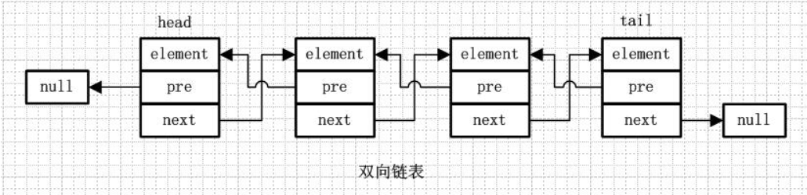

## 前言

主要是模拟Java中的LinkList的实现。


## LinkedList概述

LinkedList是一种双向链表。

根据双向链表的特点，会有头节点和尾节点，并且节点之间是通过前驱指针和后继指针来维护关系的，而不是像数组那样通过位置下标来维护节点间关系的。所以既可以从头到尾遍历，又可以从尾到头遍历。

双向链表是包含两个指针的，pre指向前一个节点，next指向后一个节点，但是第一个节点head的pre指向null，最后一个节点的tail的next指向null。




LinkedList是一个继承于AbstractSequentialList，并实现了List接口和Deque接口的双端链表。

LinkedList底层的链表结构使它支持高效的插入和删除操作，另外它实现了Deque接口，使得LinkedList类也具有队列的特性(addFirst(),removeLast()…)，它可以被当作堆栈、队列或双端队列进行操作。

LinkedList 实现了Cloneable接口，即覆盖了函数clone()，能克隆。

```
public class LinkedList<E>
    extends AbstractSequentialList<E>
    implements List<E>, Deque<E>, Cloneable, java.io.Serializable{
    ...
    }
```

LinkedList不是线程安全的，如果想使LinkedList变成线程安全的，可以调用静态类Collections类中的synchronizedList方法。

和ArrayList一样，类中的iterator()方法和listIterator()方法返回的iterators迭代器是**fail-fast**的：当某一个线程A通过iterator去遍历某集合的过程中，若该集合的内容被其他线程所改变了；那么线程A访问集合时，就会抛出ConcurrentModificationException异常，产生fail-fast事件，底层由modCount实现。

> AbstractSequentialList 实现了get(int index)、set(int index, E element)、add(int index, E element) 和 remove(int index)这些骨干性函数。降低了List接口的复杂度。这些接口都是随机访问List的，LinkedList是双向链表（链表数据结构本身不具备随机访问的特性）；既然它继承于AbstractSequentialList，就相当于已经实现了“get(int index)这些接口”。

> 此外，我们若需要通过AbstractSequentialList自己实现一个列表，只需要扩展此类，并提供 listIterator() 和 size() 方法的实现即可。若要实现不可修改的列表，则需要实现列表迭代器的 hasNext、next、hasPrevious、previous 和 index 方法即可。


## 模拟LinkedList

### Queue

```
/**
 * @ClassName Queue
 * @Description 队列
 * @Author HuangCanCan
 * @Date 2019/10/10 17:46
 * @Version 1.0
 **/
public interface Queue {

    /**
     * 将指定的元素值e插入此列表末尾
     *
     * @param e
     * @return
     */
    boolean offer(Object e);

    /**
     * 获取并移除此队列的头，如果此队列为空，则抛出NoSuchElementException异
     *
     * @return
     */
    Object remove();

    /**
     * 获取并移除此队列的头，如果此队列为空，则返回 null
     *
     * @return
     */
    Object poll();

    /**
     * 获取但不移除此队列的头；如果此队列为空，则抛出NoSuchElementException异常
     *
     * @return
     */
    Object element();

    /**
     * 获取但不移除此队列的头；如果此队列为空，则返回 null
     *
     * @return
     */
    Object peek();
}

```

### Deque

```
/**
 * @ClassName Deque
 * @Description 双端队列
 * @Author HuangCanCan
 * @Date 2019/10/10 18:23
 * @Version 1.0
 **/
public interface Deque extends Queue {
    /**
     * 将指定的元素插入此双端队列的开头
     *
     * @param e
     * @return
     */
    boolean offerFirst(Object e);

    /**
     * 将指定的元素插入此双端队列的末尾
     *
     * @param e
     * @return
     */
    boolean offerLast(Object e);

    /**
     * 获取，但不移除此双端队列的第一个元素；如果此双端队列为空，则返回 null
     *
     * @return
     */
    Object peekFirst();

    /**
     * 获取，但不移除此双端队列的最后一个元素；如果此双端队列为空，则返回 null
     *
     * @return
     */
    Object peekLast();

    /**
     * 获取并移除此双端队列的第一个元素；如果此双端队列为空，则返回 null
     *
     * @return
     */
    Object pollFirst();

    /**
     * 获取并移除此双端队列的最后一个元素；如果此双端队列为空，则返回 null
     *
     * @return
     */
    Object pollLast();

    /**
     * 将一个元素推入此双端队列所表示的堆栈（换句话说，此双端队列的头部）
     *
     * @param e
     */
    void push(Object e);

    /**
     * 从此双端队列所表示的堆栈中弹出一个元素（换句话说，移除并返回此双端队列的头部）
     */
    Object pop();

    /**
     * 从此双端队列移除第一次出现的指定元素，如果列表中不包含次元素，则没有任何改变
     *
     * @param e
     * @return
     */
    boolean removeFirstOccurrence(Object e);

    /**
     * 从此双端队列移除最后一次出现的指定元素,如果列表中不包含次元素，则没有任何改变
     *
     * @param e
     * @return
     */
    boolean removeLastOccurrence(Object e);
}

```

### LinkedList

```
import java.util.Collection;
import java.util.Iterator;
import java.util.NoSuchElementException;

/**
 * @ClassName LinkedList
 * @Description 模拟LinkedList
 * @Author HuangCanCan
 * @Date 2019/10/8 17:18
 * @Version 1.0
 **/
public class LinkedList implements List, Iterable, Deque {

    /**
     * 指向头结点，
     * <p>
     * 不变的: (first == null && last == null) || (first.prev == null && first.data != null)
     */
    private Node first;

    /**
     * 指向尾结点
     * <p>
     * 不变的: (first == null && last == null) || (last.next == null && last.data != null)
     */
    private Node last;

    /**
     * 结点个数
     */
    private int size;

    /**
     * 修改此列表的次数
     * <p>
     * 用于在迭代器遍历时,用于判断在迭代过程中是否发生了修改操作,如果发生了修改,则抛出ConcurrentModificationException异常
     */
    private int modCount;

    public LinkedList() {
    }

    public LinkedList(Collection c) {
        this();
        addAll(c);
    }

    @Override
    public int size() {
        return size;
    }

    @Override
    public Object get(int index) {
        //检查index范围
        checkElementIndex(index);

        return getNode(index).data;
    }

    /**
     * 判断元素的索引是否越界
     *
     * @param index
     */
    private void checkElementIndex(int index) {
        if (index < 0 || index > size) {
            throw new RuntimeException("指针越界异常：" + index);
        }
    }

    @Override
    public boolean isEmpty() {
        return size == 0;
    }

    @Override
    public boolean contains(Object e) {
//        判断列表中是否包含有元素值e，返回true当列表中至少存在一个元素值e
        return indexOf(e) >= 0;
    }

    /**
     * 正向查找，返回LinkedList中元素值Object data <strong>第一次</strong> 出现的位置，如果元素不存在，则返回-1
     *
     * @param data
     * @return
     */
    @Override
    public int indexOf(Object data) {
        //返回第一次出现的指定元素的索引
        int index = 0;
        if (data == null) {
            for (Node x = first; x != null; x = x.next) {
                if (x.data == null) {
                    return index;
                }
                index++;
            }
        } else {
            for (Node x = first; x != null; x = x.next) {
                if (data.equals(x.data)) {
                    return index;
                }
                index++;
            }
        }
        return -1;
    }

    /**
     * 逆向查找，返回LinkedList中元素值Object e <strong>最后一次</strong>出现的位置，如果元素不存在，则返回-1
     *
     * @param e
     * @return
     */
    public int lastIndexOf(Object e) {
        int index = size;
        if (e == null) {
            for (Node x = last; x != null; x = x.pre) {
                index--;
                if (x.data == null) {
                    return index;
                }
            }
        } else {
            for (Node x = last; x != null; x = x.pre) {
                index--;
                if (e.equals(x.data)) {
                    return index;
                }
            }
        }
        return -1;
    }

    @Override
    public void add(int index, Object data) {
        //检查index范围
        checkElementIndex(index);

        /*
          判断此索引是否等于节点的个数，如果相等那就在尾部插入元素，否则在中间插入元素
         */
        if (index == size) {
            //尾插入
            linkLast(data);
        } else {
            //中间插入
            //获取指定索引位置的节点
            Node node = getNode(index);
            //在指定索引位置的节点前插入新节点
            linkBefore(data, node);
        }

    }

    /**
     * 在非空节点node之前插入新节点的值。中间操作
     *
     * @param data 新节点的值
     * @param node 当前节点
     */
    private void linkBefore(Object data, Node node) {
        Node pred = node.pre;
        // 构建一个新的节点
        Node newNode = new Node(pred, data, node);
        //设置node的前驱节点为这个新的节点
        node.pre = newNode;
//        第一个节点head的pre指向null，最后一个节点的tail的next指向null
        //判断node是否是首节点（node.pre前驱节点为null）
        if (pred == null) {
            //表示node是首节点
            //将newNode设置为首节点
            first = newNode;
        } else {
            //node不是首节点,设置node的前驱节点的后续节点设置为新的节点
            pred.next = newNode;
        }
        //节点个数加 1
        size++;
        //修改此列表的次数加 1
        modCount++;
    }

    /**
     * 将新节点的值添加到链表尾部。尾插入
     *
     * @param data
     */
    private void linkLast(Object data) {
        Node l = last;
        //构建一个新的节点
        Node newNode = new Node(l, data, null);
        //将新节点作为尾节点
        last = newNode;
        //如果原尾节点为null，即原链表为null，则链表首节点设置为newNode
        if (l == null) {
            first = newNode;
        } else {
            //否则，原尾节点的next设置为newNode
            l.next = newNode;
        }
        //节点个数加 1
        size++;
        //修改此列表的次数加 1
        modCount++;
    }

    /**
     * 在链表头部添加元素，头插入
     *
     * @param data
     */
    private void linkFirst(Object data) {
        Node f = first;
        // 构建一个新节点
        Node newNode = new Node(null, data, f);
        //将新节点作为首节点
        first = newNode;

        //如果原首节点为null，即原链表为null，则链表尾节点也设置为newNode
        if (f == null) {
            last = newNode;
        } else {
            //否则，原首节点的pre设置为newNode
            f.pre = newNode;
        }
        //节点个数加 1
        size++;
        //修改此列表的次数加 1
        modCount++;
    }


    /**
     * 返回指定索引位置的节点
     *
     * @return
     */
    private Node getNode(int index) {
        /*
         * *************【折半思想】**************
         * 当index < size/2 (size >> 1)时，从列表首节点向后查找
         * 当 index >= size/2时，从列表尾节点向前查找
         */
        if (index < size / 2) {
            Node x = first;
            for (int i = 0; i < index; i++) {
                x = x.next;
            }
            return x;
        } else {
            Node x = last;
            for (int i = size - 1; i > index; i--) {
                x = x.pre;
            }
            return x;
        }

    }

    @Override
    public void add(Object data) {
        linkLast(data);
    }

    /**
     * 按照指定collection的迭代器所返回的元素顺序，将该collection中的所有元素添加到此链表的尾部。尾部插入
     * <p>
     * 如果指定的集合添加到链表的尾部的过程中，集合被修改，则该插入过程的后果是不确定的。
     * 一般这种情况发生在指定的集合为该链表的一部分，且其非空。
     *
     * @param c
     */
    public boolean addAll(Collection c) {
        return addAll(size, c);
    }

    /**
     * 从指定的位置开始，将指定collection中的所有元素插入到此链表中，新元素的顺序为指定collection的迭代器所返回的元素顺序
     *
     * @param index
     * @param c
     */
    public boolean addAll(int index, Collection c) {
        //检查index范围
        checkElementIndex(index);

        Object[] a = c.toArray();
        int numNew = a.length;
        if (numNew == 0) {
            return false;
        }

        Node pred, //指向需要插入节点的位置的前驱节点
                succ;//需要插入节点的位置
        if (index == size) {
            // 在链表表尾部插入集合元素
            succ = null;
            pred = last;

        } else {
            // 在中间插入
            // 获取指定索引位置的节点
            succ = getNode(index);
            pred = succ.pre;
        }

        //指定collection中的所有元素依次插入到此链表中指定位置的过程
        for (Object data : a) {
            // 构建新节点
            Node newNode = new Node(pred, data, null);
            if (pred == null) { // 如果原链表为null，则新插入的节点作为链表首节点
                first = newNode;
            } else {
                pred.next = newNode;
            }
            pred = newNode;  // pred指针向后移动，指向下一个需插入节点位置的前一个节点
        }

        //集合元素插入完成后，与原链表index位置后面的子链表链接起来
        if (succ == null) { //说明之前是在列表尾部插入的集合元素
            last = pred;  //pred指向的是最后插入的那个节点
        } else {
            // 否则，是在中间插入的集合元素
            pred.next = succ;
            succ.pre = pred;
        }

        size += numNew;
        modCount++;
        return true;

    }

    /**
     * 在链表头部添加元素，头插入
     *
     * @param data
     */
    public void addFirst(Object data) {
        linkFirst(data);
    }

    /**
     * 在链表尾部添加元素，等价于add
     *
     * @param data
     */
    public void addLast(Object data) {
        linkLast(data);
    }

    @Override
    public boolean addBefore(Object obj, Object e) {
        int index = indexOf(obj);
        if (index < 0) {
            return false;
        }
        add(index, e);
        return true;
    }

    @Override
    public boolean addAfter(Object obj, Object e) {
        int index = indexOf(obj);
        if (index < 0) {
            return false;
        }
        add(index + 1, e);
        return true;
    }

    @Override
    public Object remove(int index) {
        checkElementIndex(index);

        Node oldNode = getNode(index); // 获取指定索引处的节点，老节点
        return unlink(oldNode);
    }

    /**
     * 删除非空节点node
     *
     * @param node 要删除的节点
     * @return
     */
    private Object unlink(Node node) {
        Object oldValue = node.data;
        Node prev = node.pre; //老节点的前驱节点
        Node next = node.next; // 老节点的后续节点

//        更改老节点的前驱节点和后续节点的的关联
//        prev.next = next;
//        next.pre = prev;

        /*
            需要判断删除的元素是否是头节点和尾节点
         */
        if (prev == null) { //代表该节点是头节点
            first = next;
        } else {    // 不是头结点
            prev.next = next;
            node.pre = null;
        }

        if (next == null) { //代表该节点是尾节点
            last = prev;
        } else { // 不是尾结点
            next.pre = prev;
            node.next = null;
        }

        node.data = null; // 使GC能够快速回收

        size--;
        modCount++;

        return oldValue;
    }

    @Override
    public boolean remove(Object e) {
        //移除列表中首次出现的指定元素(如果存在)，LinkedList中允许存放重复的元素
        /*
         * 第一种：
         */
//        int index = indexOf(e);//返回元素e第一次出现的索引
//        if (index < 0) {
//            return false;
//        }
//        remove(index);
//        return true;

        if (e == null) {
            for (Node x = first; x != null; x = x.next) {
                if (x.data == null) {
                    unlink(x);
                    return true;
                }
            }
        } else {
            for (Node x = first; x != null; x = x.next) {
                if (e.equals(x.data)) {
                    unlink(x);
                    return true;
                }
            }
        }
        return false;
    }

    /**
     * 替换指定索引位置节点的元素值，并返回旧值
     *
     * @param index   索引
     * @param element 元素的值
     * @return
     */
    private Object set(int index, Object element) {
        checkElementIndex(index);
        Node node = getNode(index);
        Object oldValue = node.data;
        node.data = element;
        return oldValue;
    }

    @Override
    public Object replace(int index, Object e) {
        return set(index, e);
    }

    @Override
    public String toString() {
        if (size == 0) {
            return "[]";
        }
        StringBuilder builder = new StringBuilder("[");
        Node p = first;
        for (int i = 0; i < size; i++) {
            if (i != size - 1) {
                builder.append(p.data + ",");
            } else {
                builder.append(p.data);
            }

            //移动指针到下一个结点
            p = p.next;
        }

        builder.append("]");
        return builder.toString();
    }

    @Override
    public Iterator iterator() {

        return new LinkedListIteraor();
    }

    /**
     * 获取列表首节点元素值
     */
    public Object getFirst() {
        Node head = first;
        if (head == null) {
            throw new NoSuchElementException();
        }
        return head.data;
    }

    /**
     * 获取列表尾节点元素值
     */
    public Object getLast() {
        Node tail = last;
        if (tail == null) {
            throw new NoSuchElementException();
        }
        return tail.data;
    }

    /**
     * 移除首节点，并返回该节点的元素值
     *
     * @return
     */
    public Object removeFirst() {
        final Node f = first;
        if (f == null)
            throw new NoSuchElementException();
        return unlinkFirst(f);
    }

    /**
     * 移除尾节点，并返回该节点的元素值
     *
     * @return
     */
    public Object removeLast() {
        final Node l = last;
        if (l == null)
            throw new NoSuchElementException();
        return unlinkLast(l);
    }

    /**
     * 删除非空的首节点f
     */
    private Object unlinkFirst(Node f) {
        Object element = f.data;
        Node next = f.next;
        f.data = null;
        f.next = null; // help GC
        first = next; //将原首节点的next节点设置为首节点
        if (next == null)  //如果原链表只有一个节点，即原首节点，删除后，链表为null
            last = null;
        else
            next.pre = null;
        size--;
        modCount++;
        return element;
    }

    //删除非空的尾节点l
    private Object unlinkLast(Node l) {
        // assert l == last && l != null;
        final Object element = l.data;
        final Node prev = l.pre;
        l.data = null;
        l.pre = null; // help GC
        last = prev; //将原尾节点的prev节点设置为尾节点
        if (prev == null) //如果原链表只有一个节点,则删除后，链表为null
            first = null;
        else
            prev.next = null;
        size--;
        modCount++;
        return element;
    }

    @Override
    public boolean offer(Object e) {
//        将指定的元素值e插入此列表末尾
        add(e);
        return true;
    }

    @Override
    public Object remove() {
        //获取并 移除 此队列的头，如果此队列为空，则抛出NoSuchElementException异
        return removeFirst();
    }

    @Override
    public Object poll() {
        //获取并 移除 此队列的头，如果此队列为空，则返回 null
        Node f = first;
        return f == null ? null : unlinkFirst(f);
    }

    @Override
    public Object element() {
        //获取但 不移除 此队列的头；如果此队列为空，则抛出NoSuchElementException异常
        return getFirst();
    }

    @Override
    public Object peek() {
        //获取但 不移除 此队列的头；如果此队列为空，则返回 null
        Node f = first;
        return f == null ? null : f.data;
    }

    @Override
    public boolean offerFirst(Object e) {
        addFirst(e);
        return true;
    }

    @Override
    public boolean offerLast(Object e) {
        addLast(e);
        return true;
    }

    @Override
    public Object peekFirst() {
        final Node f = first;
        return (f == null) ? null : f.data;
    }

    @Override
    public Object peekLast() {
        final Node l = last;
        return (l == null) ? null : l.data;
    }

    @Override
    public Object pollFirst() {
        final Node f = first;
        return (f == null) ? null : unlinkFirst(f);
    }

    @Override
    public Object pollLast() {
        final Node l = last;
        return (l == null) ? null : unlinkLast(l);
    }

    @Override
    public void push(Object e) {
        addFirst(e);
    }

    @Override
    public Object pop() {
        return removeFirst();
    }

    @Override
    public boolean removeFirstOccurrence(Object e) {
        return remove(e);
    }

    @Override
    public boolean removeLastOccurrence(Object e) {
        if (e == null) {
            for (Node x = last; x != null; x = x.pre) { //逆向向前
                if (x.data == null) {
                    unlink(x);
                    return true;
                }
            }
        } else {
            for (Node x = last; x != null; x = x.pre) {
                if (e.equals(x.data)) {
                    unlink(x);
                    return true;
                }
            }
        }
        return false;
    }

    public static class Node {
        /**
         * 要存储的数据
         */
        Object data;
        /**
         * 后续结点
         */
        Node next;
        /**
         * 前驱结点
         */
        Node pre;

        public Node(Node pre, Object data, Node next) {
            this.pre = pre;
            this.data = data;
            this.next = next;
        }
    }

    private class LinkedListIteraor implements Iterator {

        /**
         * 起始位置的后续节点
         */
        private Node current = first.next;
        /**
         * 记录此刻集合修改的总次数,之后会拿modCount再和此值作比较,如果不相等,说明在迭代过程中,集合发生了修改操作,则会抛出ConcurrentModification异常
         */
        private int expectedModCount = modCount;

        /**
         * 判断是否可以向后移动指针
         */
        private boolean canMove = false;

        @Override
        public boolean hasNext() {
            //后续节点与尾节点比较，如果不相等证明还有元素没有迭代完
            return current != last;
        }

        @Override
        public Object next() {
            if (expectedModCount != modCount) {
                throw new java.util.ConcurrentModificationException();
            }
            if (!hasNext()) {
                throw new java.util.NoSuchElementException();
            }
            Object nextVal = current.data;
            current = current.next;
            canMove = true;
            return nextVal;
        }

        @Override
        public void remove() {
            if (expectedModCount != modCount) {
                throw new java.util.ConcurrentModificationException();
            }
            if (!canMove) {
                throw new IllegalStateException();
            }

            LinkedList.this.unlink(current.pre);

            canMove = false;
            expectedModCount++;
        }

    }
}


```


## 遍历集合时进行修改或删除操作为什么会抛出ConcurrentModificationException？

如一下代码：以上面的代码为例

```
LinkedList linkedList = new LinkedList();
linkedList.add(1);
linkedList.add(2);
linkedList.add(3);
linkedList.add(4);
linkedList.add(5);
linkedList.add(6);
 for (Object i : linkedList) {
 	if ((Integer) i == 2) {
 		linkedList.remove(2);
 	}
 }

输出：Exception in thread "main" java.util.ConcurrentModificationException

```

原因：

因为增强的for循环内部使用的是iterator迭代器的方式进行遍历的,在遍历过程中,如果进行修改操作会导致exceptedModCount的值和modCount的值不相等.因此会抛出ConcurrentModificationException的异常。

正确的删除元素的方式应该是使用iterator()的方式遍历并进行删除操作,因为迭代器中的remove()方法和集合中的remove()有一点不同就是,前者删除后,会进行exceptedModCount++,因为不会抛出上面那个异常。

下面的代码不会抛出ConcurrentModificationException：

```
 Iterator iterator = linkedList.iterator();
 while (iterator.hasNext()) {
     Integer next = (Integer) iterator.next();
     if (next == 2) {
     	iterator.remove();
     }
 }
```

## 总结

LinkedList是基于双向链表实现的，适合增删多查找少的场景。

LinkedList添加的元素，取时与添加时的顺序一致。因为向双向链表的尾部添加元素，然后按照头节点顺序遍历获取，所以一致。

LinkedList允许添加重复元素。

LinkedList不是线程安全的集合。

LinkedList允许添加null元素。

add方法插入元素是在双向链表的尾部插入。

get方法遍历双向链表，先判断下标靠近头节点还是尾节点，这样会减少多余的循环。

折半思想：当index < size/2 (size >> 1)时，从列表首节点向后查找；当 index >= size/2时，从列表尾节点向前查找